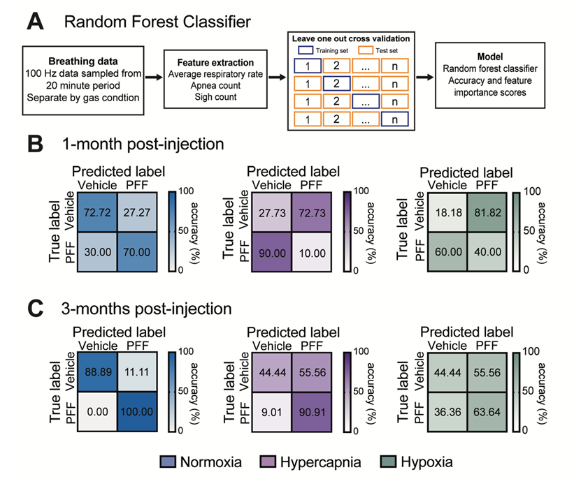

<h2 align="left"><b>Time to focus on the locus (coeruleus): functional decline in a mouse model of early Parkinson’s disease</b></h2>

Parkinson’s disease (PD) is characterized by α-synuclein aggregation and progressive neuronal loss throughout the brain. Prodromal symptoms suggest early brainstem pathology, particularly within the locus coeruleus (LC), one of the first afflicted brain regions in PD. As the main source of noradrenaline (NA) for the central nervous system, the LC is a critical modulator of arousal, anxiety, sleep, and breathing. Despite this, the functional consequences of PD pathology in the LC and how this disruption drives disease presentation remain poorly understood.

We bilaterally injected α-synuclein pre-formed fibrils (PFF) into the LC of mice and utilized a multi-scale approach to determine cellular and behavioral outcomes at 1-and-3-months post-injection. Immunohistochemistry revealed progressive α-synuclein pathology in the LC which corresponded with time-dependent disruptions in arousal-related functions, transitioning from hyperactivity to hypoactivity across nesting behavior, grooming and locomotion. Sleep architecture was disrupted with impaired sleep initiation and abnormal sleep-to-wake phase transitions.

Respiratory assessment via whole-body plethysmography revealed elevated baseline respiratory rate and a blunted response to gas challenge with high CO2 in PFF-injected mice, consistent with LC circuit dysfunction. We employed a machine learning classifier, which predicted LC pathology based on breathing alone with high accuracy, providing further evidence for the significance of the noted respiratory phenotype. Finally, whole-cell patch clamp electrophysiology demonstrated neuronal dysfunction that may directly contribute to the observed behavioral and physiological phenotypes.  These findings demonstrate that early α-synuclein pathology in the LC produces cellular dysfunction and a constellation of non-motor symptoms—including respiratory abnormalities, sleep-wake disruption, and arousal dysregulation—that recapitulate those seen in prodromal PD, establishing the LC as a mechanistic substrate for early disease manifestation.

  

